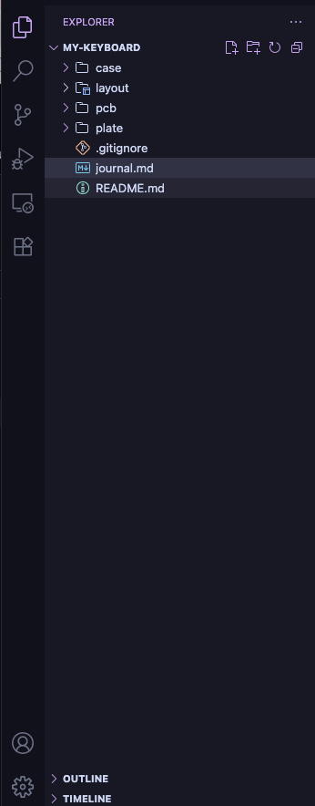
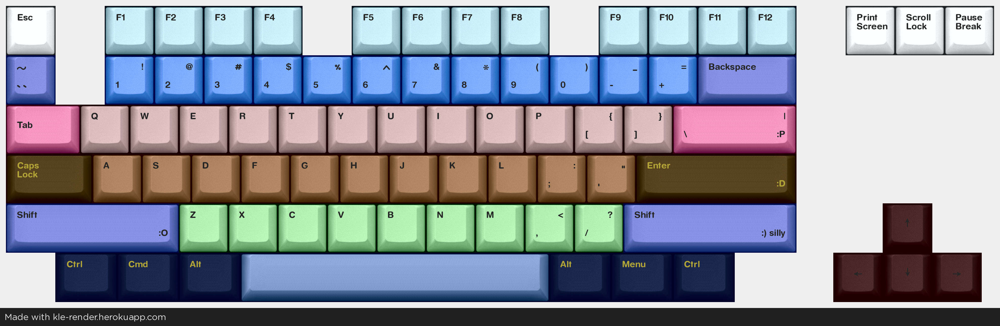

#This journal was created after I start bc my lapse didnt work, and i had to learn how to journal and all that stuff
While i have recording it's not on lapse.Enjoy!

8-8-2026:The beginning(2hrs)
My first hardware project!
I started by adding all my files

After, I put the kicad files that should be ignored, in my gitignore.
I spent the rest of the time making a visual layout.

8-9-2026:Setup(1hr)
After making the visual layout, i extracted the code and put it in a layout folder.
Then, i had to install marbastlib and Kicad. It took SO long to set it up that 2/3 of my recording is me asking copilot how
to fix my libraries, bc i had bypass restrictions and all of that..
I at least managed to open the pcb app which is HUGE.
